# Replace a leaking shower cartridge

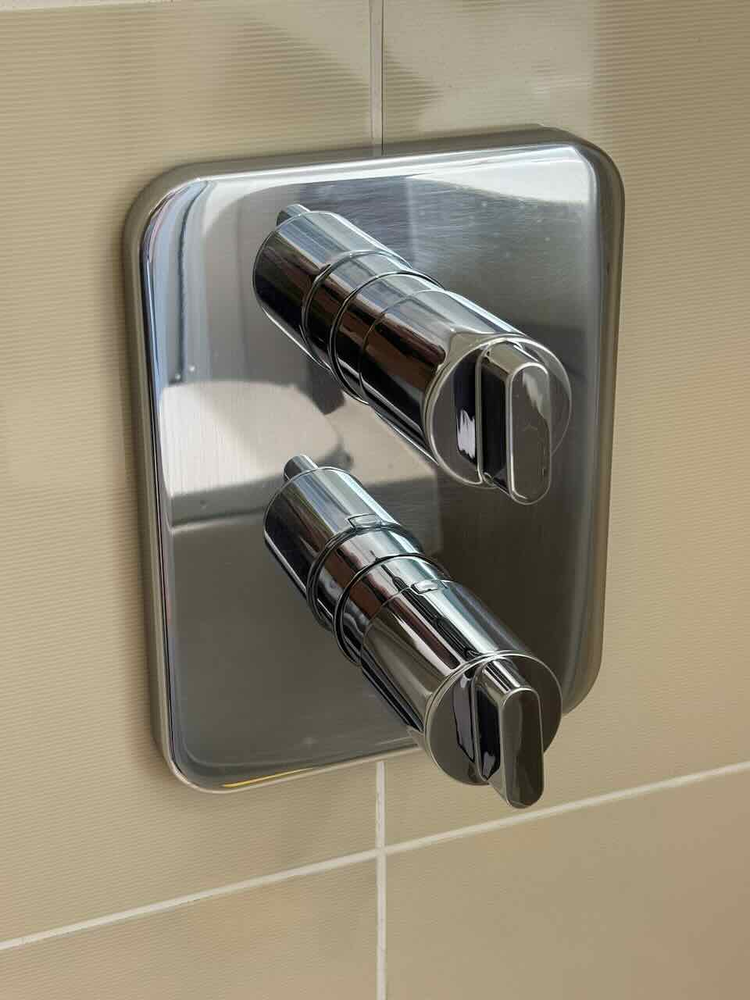{ width="350" align="right" }

If water is leaking from the shower knob, it may be caused by a faulty cartridge. This guide covers how to disassemble the shower unit and replace the cartridge.

## Compatible cartridges

The original cartridges are no longer available. The table below lists compatible alternatives.

| Description           | Compatible Model                 |
|-----------------------|----------------------------------|
| Flow Cartridge        | Ideal Standard / Trevi A960462NU [Spec](replace-shower-cartridge/trevi-flow-cartridge-a960462nu.jpeg){target=_blank} | 
| Thermostatic Cartridge | NA                               |

## Before you start

You will need to turn off the water supply to the shower at Step 4. You can do this either by turning off the mains, or by using the control valves located under the bathroom sink.

---

## Step 1 - Remove the knobs

To remove the chrome backplate and access the shower internals, you first need to take off the knobs.

Each knob is secured by a small hex screw on the underside. The screw location differs between the flow knob and the temperature control knob.

| Flow knob | Thermostatic knob |
|---|---|
| The screw can be accessed through an opening on the bottom of the knob. | The screw sits flushed at the bottom of the knob. |
| 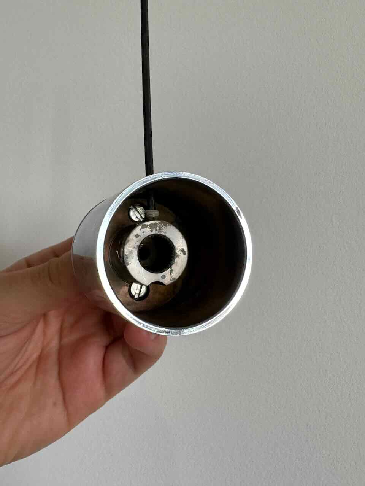{ width=350} | 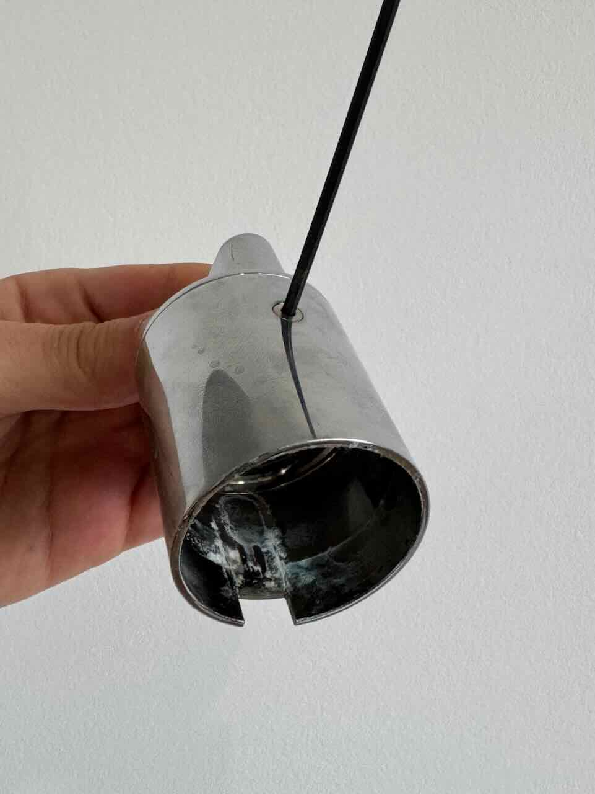{width=350} |

Even with the screws removed, the knobs may be difficult to slide off due to scale buildup. Spray some WD-40 into the knobs to help loosen them.

---

## Step 2 - Remove the chrome plate

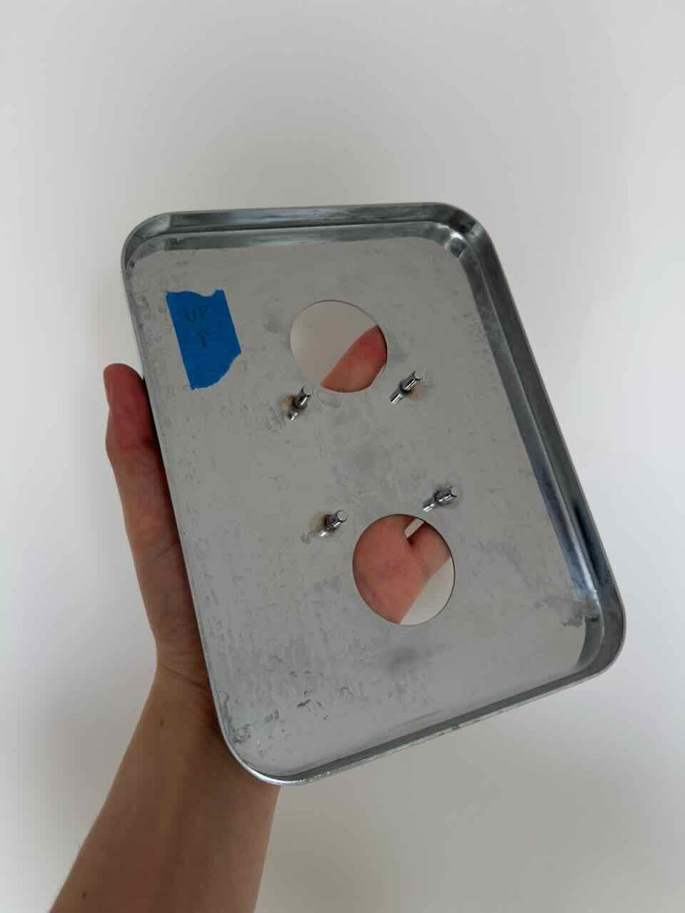{ width="350" align=right}

With the knobs removed you can now take off the chrome backplate. It is held in place by 4 pins lodged into a base plate. Gently pull the chrome plate evenly on all four sides until it comes free.

Once removed, make a note of which side was facing up so you can refit it the correct way round.

---

## Step 3 - Remove the base plate

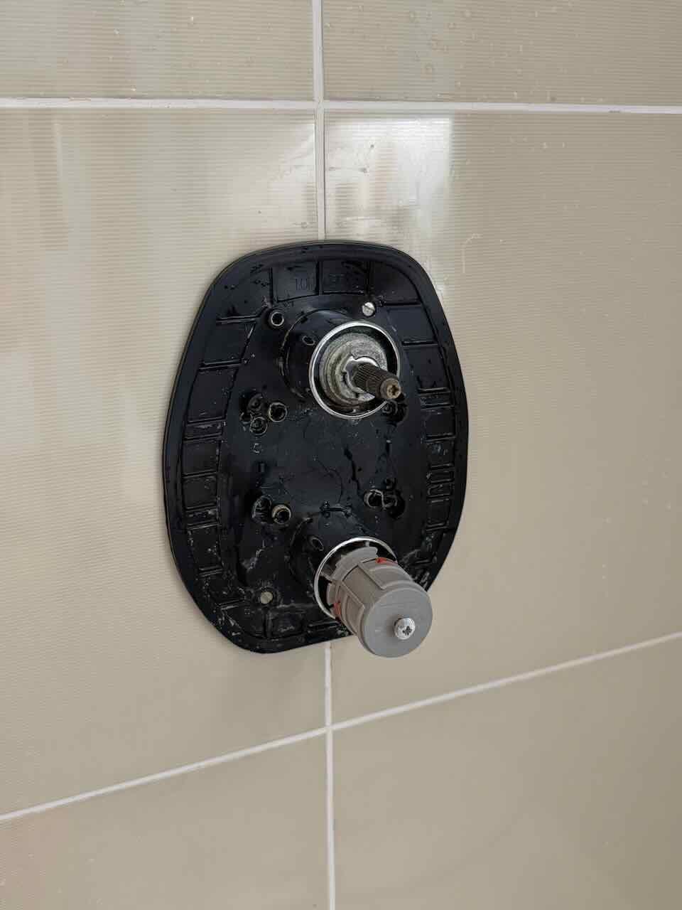{ width="350" align=right}

The base plate is secured by a few screws. Remove them and set the plate aside.

---

## Step 4 - Remove the cartridge

!!! warning
    Make sure the water supply is turned off before removing the cartridge.

Remove the chrome sleeve to expose the cartridge, use WD-40 if the sleeve is seized. Then unscrew the cartridge with a wrench.

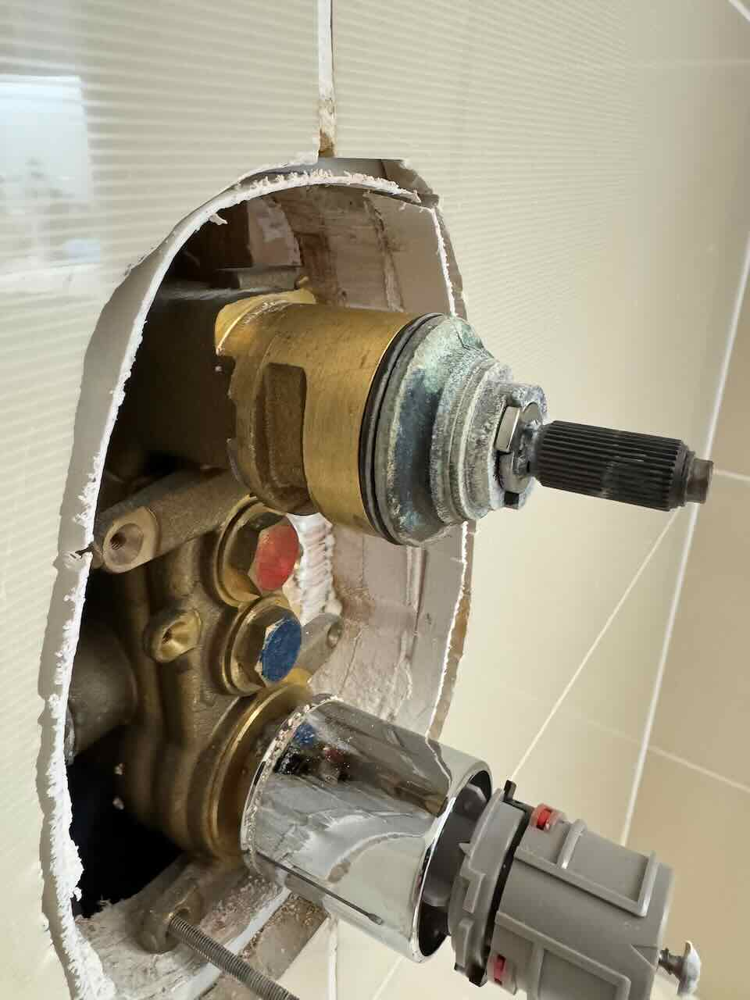{ width="350"}

The old cartridge's seal gasket may have stayed behind inside the chamber - check and remove it before fitting the new cartridge.

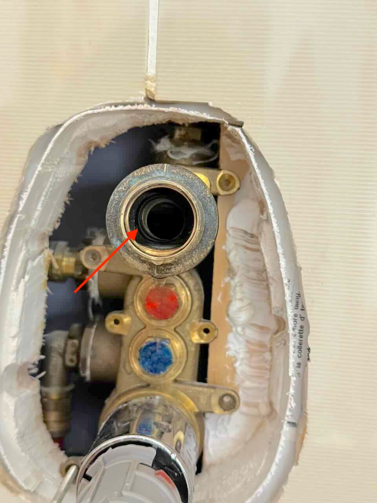{ width="350"}

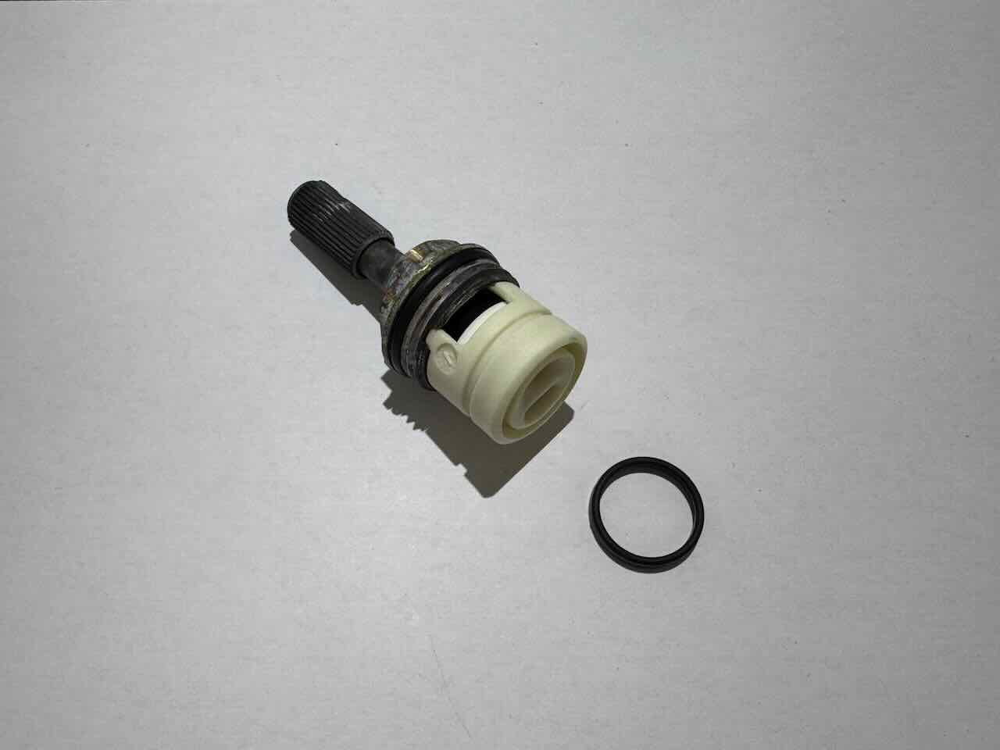{ width="350"}

---

## Step 5 - Fit the new cartridge

The old cartridge has a black collar with teeth that grip the knob. Transfer this collar onto the new cartridge so the knob will have a firm grip.

| Remove collar | Add collar on new cartridge |
|---|---|
| 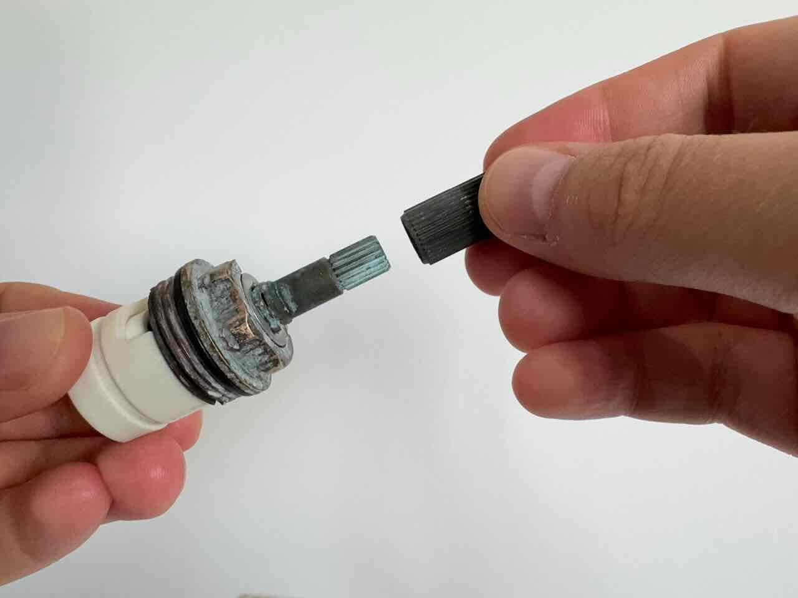{ width="350"} | 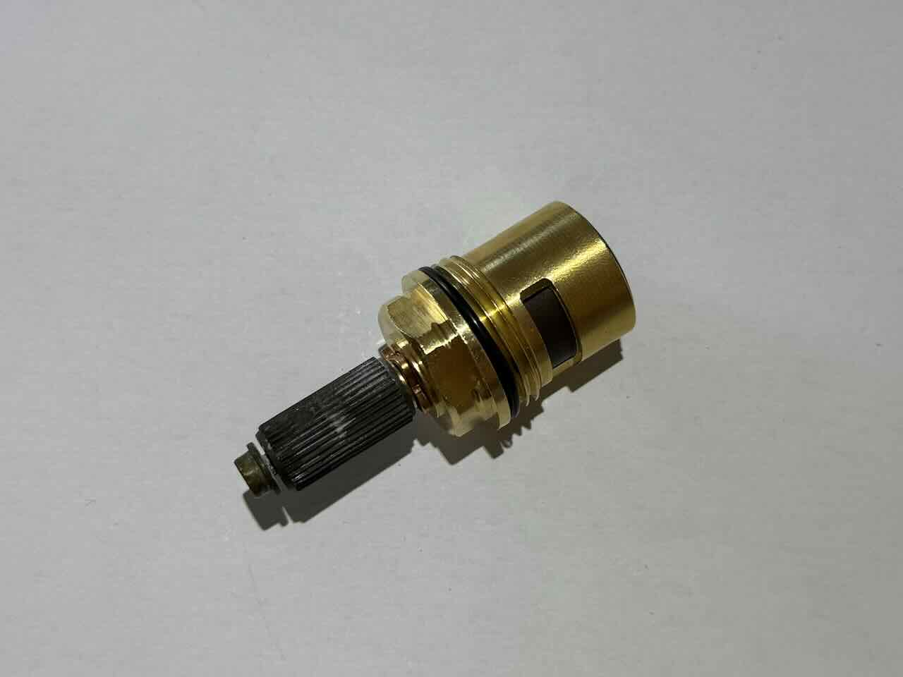{ width="350"} |

Screw the new cartridge in.

At this point you can run a test. Turn the water back on and check:

- There is no leak around the cartridge
- The flow cartridge is working correctly

Once satisfied, refit the chrome sleeve.

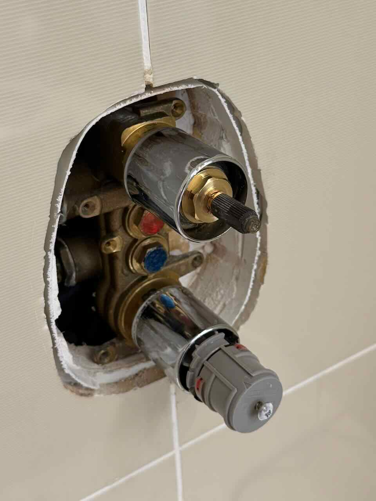{ width="350"}

---

## Step 6 - Reassemble

Screw the base plate back on. Check the seal against the tiles on all sides before fully tightening.

Push the chrome plate back in, making sure it is the right way up.

Refit the knobs and tighten the retaining screws.

You're done!
